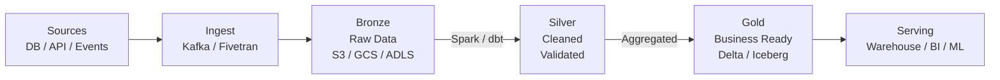
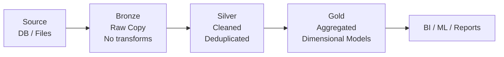
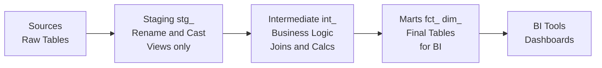
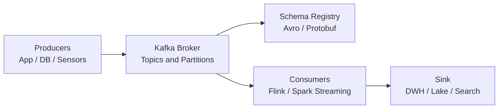
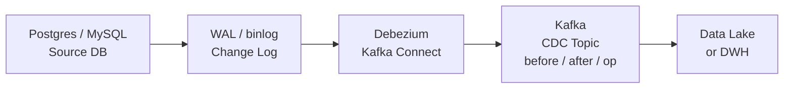

# The Ultimate Data Engineering Guide

> Built by **Mano Harsha Sappa**
> 
> [](https://www.linkedin.com/in/manoharshasappa/)
> [](https://manoharshasappa.github.io/portfolio_ManoHarshaSappa/)
> [](mailto:sappamanoharsha@gmail.com)

---

A single, complete reference for everything in modern data engineering — fundamentals to production systems, real company architectures, interview prep, 200+ tools, books, and communities. Curated from the best resources on the internet and organized for clarity.

---

## Detailed Guide Files

Each section below has a standalone deep-dive file in the [`guide/`](guide/) folder:

| # | File | What's Inside |
|---|------|---------------|
| 01 | [Introduction](guide/01-introduction.md) | What is DE, career paths, job levels, roadmap, glossary |
| 02 | [Fundamentals](guide/02-fundamentals.md) | 4 Vs, Lambda/Kappa/Medallion, ETL vs ELT, batch vs streaming |
| 03 | [Essential Skills](guide/03-essential-skills.md) | Python, SQL, Git, Linux, Docker, Cloud basics |
| 04 | [Advanced Skills](guide/04-advanced-skills.md) | Kafka, Spark, MapReduce, Flink, HDFS deep dives |
| 05 | [Data Storage](guide/05-data-storage.md) | SQL/NoSQL, Delta Lake, Iceberg, file formats, warehouses |
| 06 | [Orchestration](guide/06-orchestration.md) | Airflow, Prefect, Kestra, Dagster, dbt workflows |
| 07 | [Cloud Platforms](guide/07-cloud-platforms.md) | AWS, GCP, Azure services, Terraform patterns |
| 08 | [dbt & Data Modeling](guide/08-dbt-modeling.md) | Full Kimball project, incremental models, SCD Type 2, tests |
| 09 | [Hands-On Course](guide/09-hands-on-course.md) | 9-week structured learning plan with exercises |
| 10 | [Tools Catalog](guide/10-tools-catalog.md) | 200+ tools with decision guides and comparisons |
| 11 | [Case Studies](guide/11-case-studies.md) | 25 company deep-dives: Netflix, Uber, LinkedIn, Airbnb… |
| 12 | [Best Practices](guide/12-best-practices.md) | Production patterns, security, CI/CD, cost optimization |
| 13 | [Interview Prep](guide/13-interview-prep.md) | 56+ Q&As, SQL coding, system design, behavioral |
| 14 | [Books & Resources](guide/14-books-resources.md) | 35+ books with summaries and learning paths |
| 15 | [Communities](guide/15-communities.md) | Discords, Slacks, podcasts, newsletters, creators |
| 16 | [Projects](guide/16-projects.md) | 10 portfolio projects with full implementation guides |

---

## Table of Contents

1. [What is Data Engineering?](#1-what-is-data-engineering)
2. [Career Paths & Roadmap](#2-career-paths--roadmap)
3. [Core Concepts & Fundamentals](#3-core-concepts--fundamentals)
4. [Essential Skills](#4-essential-skills)
5. [Advanced Skills](#5-advanced-skills)
6. [Data Storage & Formats](#6-data-storage--formats)
7. [Orchestration & Workflow](#7-orchestration--workflow)
8. [Cloud Platforms](#8-cloud-platforms)
9. [dbt & Data Modeling](#9-dbt--data-modeling)
10. [Data Quality & Testing](#10-data-quality--testing)
11. [Streaming & Real-Time Data](#11-streaming--real-time-data)
12. [Batch Processing](#12-batch-processing)
13. [Data Lake Formats](#13-data-lake-formats-delta--iceberg--hudi)
14. [Change Data Capture (CDC)](#14-change-data-capture-cdc)
15. [Data Warehousing](#15-data-warehousing)
16. [Infrastructure as Code (Terraform)](#16-infrastructure-as-code-terraform)
17. [Docker & Local Development](#17-docker--local-development)
18. [SQL Reference](#18-sql-reference)
19. [Best Practices & Production Patterns](#19-best-practices--production-patterns)
20. [Company Case Studies](#20-company-case-studies)
21. [Interview Preparation](#21-interview-preparation)
22. [Tools Catalog (200+)](#22-tools-catalog-200)
23. [Portfolio Projects](#23-portfolio-projects)
24. [Books](#24-books)
25. [Courses & Certifications](#25-courses--certifications)
26. [Newsletters](#26-newsletters)
27. [Podcasts](#27-podcasts)
28. [YouTube Creators](#28-youtube-creators)
29. [LinkedIn Creators](#29-linkedin-creators)
30. [Communities](#30-communities)
31. [Whitepapers & Research](#31-whitepapers--research)
32. [Glossaries](#32-glossaries)
33. [Public Datasets](#33-public-datasets)
34. [Company Tech Blogs](#34-company-tech-blogs)

---

## 1. What is Data Engineering?

Data Engineering is the practice of designing, building, and maintaining the infrastructure and pipelines that collect, store, process, and serve data at scale. Data engineers are the builders of the data world — they create the systems that data scientists, analysts, and ML engineers rely on.

**Core responsibilities:**
- Build and maintain data pipelines (ETL/ELT)
- Design data models and schemas
- Manage data warehouses, data lakes, and lakehouses
- Ensure data quality, reliability, and freshness
- Optimize query performance and infrastructure costs
- Enable self-service analytics for the business

**The Data Engineering Lifecycle** (Joe Reis & Matt Housley):
```
Generation → Ingestion → Transformation → Serving → Analytics/ML/BI
```

**End-to-End Modern Data Platform:**



**How it differs from other roles:**

| Role | Focus |
|------|-------|
| Data Engineer | Build pipelines, infrastructure, data platforms |
| Data Scientist | Build models, run experiments, extract insights |
| Data Analyst | Query data, build dashboards, answer business questions |
| Analytics Engineer | Transform raw data into clean models (dbt), bridge DE + Analyst |
| ML Engineer | Deploy and serve ML models in production |

---

## 2. Career Paths & Roadmap

### Levels

| Level | Years Exp | What You Do |
|-------|-----------|-------------|
| Junior DE | 0–2 | Write SQL, basic Python ETL, follow existing patterns |
| Mid DE | 2–5 | Build pipelines independently, design simple schemas, operate data warehouse |
| Senior DE | 5–8 | Architect systems, mentor others, performance tuning, cost optimization |
| Staff / Principal | 8+ | Cross-team technical strategy, platform thinking, org-level impact |

### The 2024 Learning Roadmap

**Stage 1 — Foundation (months 1–3)**
- SQL (window functions, CTEs, aggregations, joins)
- Python (pandas, requests, sqlalchemy, pydantic)
- Linux basics (bash, cron, ssh, file processing)
- Git (branches, PRs, rebasing)
- Docker (run containers, docker-compose, build images)

**Stage 2 — Core Data Engineering (months 3–6)**
- Cloud storage: AWS S3 or GCP GCS
- Data warehouses: BigQuery, Snowflake, or Redshift
- Orchestration: Apache Airflow or Prefect
- dbt (staging, marts, tests, incremental models)
- Data modeling: star schema, SCD Type 2, medallion architecture

**Stage 3 — Advanced (months 6–12)**
- Apache Spark (batch, Structured Streaming, Delta Lake)
- Apache Kafka (producers, consumers, Schema Registry)
- Streaming patterns (watermarks, exactly-once, DLQ)
- Infrastructure as Code: Terraform
- CDC: Debezium + Kafka

**Stage 4 — Production (ongoing)**
- Data quality at scale (Great Expectations, Soda, Elementary)
- Observability and alerting
- Cost optimization (partition pruning, Z-ordering, query tuning)
- Data governance, PII masking, GDPR
- System design patterns

### Breaking In — Practical Tips

1. Build one end-to-end project (ingest → transform → serve → visualize)
2. Make it public on GitHub with a clear README
3. Use real public data (NYC Taxi, GitHub Archive, Wikipedia)
4. Write about what you learned on LinkedIn or a blog
5. Get comfortable explaining your design decisions
6. Follow the [2024 breaking into data engineering roadmap](https://blog.dataengineer.io/p/the-2024-breaking-into-data-engineering)

---

## 3. Core Concepts & Fundamentals

### The 4 Vs of Big Data

| V | Description | Example |
|---|-------------|---------|
| **Volume** | How much data | 10 TB/day of clickstream |
| **Velocity** | How fast data arrives | 1M events/second |
| **Variety** | Formats and sources | JSON, CSV, Parquet, images |
| **Veracity** | Quality and accuracy | Missing values, duplicates |

### Architecture Patterns

**Lambda Architecture**
- Batch layer: processes all historical data (Spark, Hive)
- Speed layer: processes recent data in real time (Flink, Kafka Streams)
- Serving layer: merges batch + speed views for queries
- Problem: dual codebase, maintenance burden

**Kappa Architecture**
- Everything is a stream — no separate batch layer
- Historical reprocessing = replay from Kafka topic
- Simpler: one codebase, one processing engine
- Preferred at companies like LinkedIn

**Medallion Architecture (most common today)**
- Bronze: raw data exactly as received from source
- Silver: cleaned, validated, deduplicated data
- Gold: business-ready aggregations, dimensional models for BI



**Data Mesh**
- Data as a product — each domain owns their data
- Federated governance — central standards, distributed ownership
- Self-serve infrastructure platform
- Key for large orgs: Zalando, JPMorgan, HelloFresh

**Data Lakehouse**
- Combines data lake (cheap storage, open formats) + data warehouse (ACID, SQL, BI)
- Powered by Delta Lake, Apache Iceberg, Apache Hudi
- Single platform for both BI and ML workloads

### ETL vs ELT

| | ETL | ELT |
|-|-----|-----|
| Transform when | Before loading | After loading |
| Where | Separate compute | Inside warehouse |
| Tools | Informatica, Talend | dbt, Spark SQL |
| Best for | Legacy, sensitive data | Cloud warehouses |

### Batch vs Streaming

| | Batch | Micro-batch | Streaming |
|-|-------|-------------|-----------|
| Latency | Hours–days | Seconds–minutes | Milliseconds |
| Tools | Spark, Hive | Spark Structured Streaming | Flink, Kafka Streams |
| Use case | Daily reports | Near-real-time dashboards | Fraud detection, alerting |

---

## 4. Essential Skills

### Python for Data Engineers

**Key Libraries:**
- `pandas` — data manipulation, small-to-medium datasets
- `pydantic` — data validation and schema enforcement
- `sqlalchemy` — database connections and ORM
- `requests` — REST API calls with retry/backoff
- `boto3` — AWS SDK
- `google-cloud-storage` — GCP SDK
- `apache-airflow` — workflow orchestration
- `great_expectations` — data quality testing

**Essential Patterns:**

*Idempotent Upsert (PostgreSQL):*
```sql
INSERT INTO target (id, col1, col2, updated_at)
VALUES (%s, %s, %s, NOW())
ON CONFLICT (id) DO UPDATE SET
  col1 = EXCLUDED.col1,
  col2 = EXCLUDED.col2,
  updated_at = EXCLUDED.updated_at;
```

*Retry with exponential backoff:*
```python
import time
def retry(fn, max_attempts=5, base_delay=1):
    for attempt in range(max_attempts):
        try:
            return fn()
        except Exception as e:
            if attempt == max_attempts - 1:
                raise
            time.sleep(base_delay * (2 ** attempt))
```

*Pagination pattern:*
```python
def fetch_all(url, params):
    page, results = 1, []
    while True:
        resp = requests.get(url, params={**params, "page": page}).json()
        results.extend(resp["items"])
        if not resp.get("has_next"):
            break
        page += 1
    return results
```

### SQL Fundamentals

**Window Functions:**
```sql
ROW_NUMBER() OVER (PARTITION BY customer_id ORDER BY created_at DESC)
SUM(revenue)  OVER (PARTITION BY month ORDER BY day ROWS UNBOUNDED PRECEDING)
LAG(revenue, 1) OVER (PARTITION BY region ORDER BY month)
AVG(revenue)  OVER (PARTITION BY region ORDER BY day ROWS 6 PRECEDING)
```

**Key Query Patterns:**
- Always use NOT EXISTS instead of NOT IN (handles NULLs correctly)
- Use CTEs instead of correlated subqueries for readability and performance
- Filter on partition columns directly (`order_date BETWEEN ...` not `YEAR(order_date) = ...`)
- Use `APPROX_COUNT_DISTINCT()` in BigQuery for cardinality at scale

**SCD Type 2 Pattern:**
Track full history of dimension changes by closing old records and inserting new versions:
- `valid_from`, `valid_to`, `is_current` columns
- Close changed records: `UPDATE SET valid_to = yesterday, is_current = FALSE`
- Insert new version: `INSERT WITH valid_from = today, is_current = TRUE`

### Git for Data Engineers
```bash
git checkout -b feature/new-pipeline
git add dags/my_dag.py
git commit -m "Add daily orders DAG"
git push origin feature/new-pipeline
# Open Pull Request → Code Review → Merge
```

---

## 5. Advanced Skills

### Apache Kafka

**Core Concepts:**
- **Topic** — named stream of records (like a database table)
- **Partition** — ordered, immutable log within a topic; unit of parallelism
- **Offset** — unique sequential ID per record per partition
- **Consumer Group** — multiple consumers sharing partitions; each partition goes to exactly one consumer in the group
- **Replication Factor** — number of copies across brokers for fault tolerance
- **Schema Registry** — central store for Avro/Protobuf/JSON schemas; prevents breaking changes

**Delivery Semantics:**

| Guarantee | Config | Trade-off |
|-----------|--------|-----------|
| At-most-once | `acks=0`, auto-commit before process | Fast, but data loss possible |
| At-least-once | `acks=all`, manual commit after process | Safe, duplicates possible |
| Exactly-once | `enable.idempotence=true` + transactions | Safest, most complex |

**Key Producer Config:**
- `acks=all` — wait for all in-sync replicas
- `enable_idempotence=True` — deduplication at broker level
- `compression_type=lz4` — 3–5x compression ratio
- `batch_size=16384`, `linger_ms=5` — throughput optimization

**Key Consumer Config:**
- `enable_auto_commit=False` — manual commit for at-least-once
- `auto_offset_reset=earliest` — start from beginning for new groups
- `max_poll_records=500` — limit per poll cycle

**Partition Strategy:**
- Use entity ID as key (`customer_id`) for ordered processing per entity
- `null` key = round-robin for max throughput
- Hot partition: add random salt to key or increase partition count

**Topic Design:**
```
orders.payments.completed
users.profiles.updated
inventory.products.restocked
```

Use compacted topics for latest-value-per-key (user profiles, config):
`cleanup.policy=compact` + `min.cleanable.dirty.ratio=0.1`

### Apache Spark

**Architecture:**
- Driver Program → SparkContext → Cluster Manager → Worker Nodes → Executors
- RDD (immutable distributed dataset) → DataFrame (structured, SQL-optimized)
- DAG scheduler decomposes into stages at shuffle boundaries

**Key Optimizations:**
- **AQE (Adaptive Query Execution)** — dynamically adjusts plan at runtime based on statistics
- **Broadcast joins** — for small tables (<10 MB), broadcast to all executors, avoid shuffle
- **Partition tuning** — target 128 MB per partition; `spark.sql.shuffle.partitions`
- **Data skew** — salt the key with a random suffix, join with salted key, then remove salt
- **Caching** — `df.cache()` for DataFrames reused multiple times in same job

**Key Operations:**
```python
df.select("id", F.col("name").alias("full_name"))
df.filter(F.col("status") == "active")
df.groupBy("region").agg(F.sum("revenue"), F.count("*"))
df.join(dim, on="id", how="left")
df.join(F.broadcast(small_table), on="code", how="left")
df.repartition(200)
df.coalesce(10)
```

**Structured Streaming:**
- Read from Kafka → parse → watermark → window → write to Delta Lake
- `trigger(processingTime="10 seconds")` for micro-batch
- Checkpoint location required for fault tolerance and exactly-once
- Watermarks handle late-arriving data: `withWatermark("event_time", "10 minutes")`

### MapReduce & Hadoop

MapReduce paradigm:
1. **Map** — transform each input record into key-value pairs
2. **Shuffle** — group all values by key across the cluster
3. **Reduce** — aggregate values per key to produce output

Key papers:
- [MapReduce: Simplified Data Processing on Large Clusters (Google, 2004)](https://research.google/pubs/mapreduce-simplified-data-processing-on-large-clusters/)
- [The Google File System (2003)](https://research.google/pubs/the-google-file-system/)

### Apache Flink

- True event-time streaming (vs Spark's micro-batch)
- Exactly-once state semantics via Chandy-Lamport checkpointing
- Stateful stream processing — windowed aggregations, joins
- Use cases: fraud detection, real-time ML feature computation, event-driven pipelines
- [Apache Flink](https://flink.apache.org/)

---

## 6. Data Storage & Formats

### Relational Databases

| Database | Best For |
|----------|---------|
| [PostgreSQL](https://www.postgresql.org/) | OLTP, general purpose, pgvector for AI |
| [MySQL](https://www.mysql.com/) | Web applications, widely supported |
| [Amazon RDS](https://aws.amazon.com/rds/) | Managed relational DB on AWS |

### NoSQL Databases

| Type | Database | Best For |
|------|----------|---------|
| Key-Value | [Redis](https://redis.io/), [DynamoDB](https://aws.amazon.com/dynamodb/) | Caching, sessions, leaderboards |
| Column | [Cassandra](https://cassandra.apache.org/), [HBase](https://hbase.apache.org/) | Time-series, IoT, wide tables |
| Document | [MongoDB](https://www.mongodb.com/), [Elasticsearch](https://www.elastic.co/) | Semi-structured, search |
| Graph | [Neo4j](https://neo4j.com/), [ArangoDB](https://www.arangodb.com/) | Relationships, recommendations |
| Time-Series | [InfluxDB](https://github.com/influxdata/influxdb), [TimescaleDB](https://www.timescale.com/), [QuestDB](https://questdb.io/) | Metrics, sensors, IoT |

### OLAP / Analytical Databases

| Database | Best For |
|----------|---------|
| [ClickHouse](https://clickhouse.com/) | Sub-second analytics, real-time dashboards |
| [Apache Druid](https://druid.apache.org/) | Real-time OLAP, event data |
| [Apache Pinot](https://pinot.apache.org/) | Low-latency user-facing analytics |
| [DuckDB](https://duckdb.org/) | Embedded analytics, local development |
| [StarRocks](https://www.starrocks.io/) | Unified OLAP |
| [Firebolt](https://www.firebolt.io/) | Cloud-native OLAP |

### File Formats

| Format | Type | When to Use |
|--------|------|-------------|
| [Apache Parquet](https://parquet.apache.org/) | Columnar | Analytics, Spark, data lakes |
| [Apache Avro](https://avro.apache.org/) | Row-based | Kafka, schema evolution |
| [Apache ORC](https://orc.apache.org/) | Columnar | Hive, Hadoop workloads |
| [Protocol Buffers](https://github.com/protocolbuffers/protobuf) | Binary | gRPC, streaming, compact |
| JSON | Text | APIs, human-readable |
| CSV | Text | Simple, universal, slow at scale |

**Why Parquet:**
- Columnar: read only queried columns (90% less I/O for wide tables)
- Predicate pushdown: skip row groups outside filter range
- Compression per column: numeric columns compress 5–10x
- Schema embedded in footer

### Data Warehouse vs Data Lake vs Lakehouse

| | Data Warehouse | Data Lake | Lakehouse |
|-|----------------|-----------|-----------|
| Format | Proprietary | Open (Parquet, ORC) | Open (Delta, Iceberg, Hudi) |
| Schema | Schema-on-write | Schema-on-read | Both |
| ACID | Yes | No | Yes |
| Cost | High | Low (object storage) | Low-medium |
| Examples | Snowflake, Redshift | S3 + Glue | Databricks, Iceberg |

---

## 7. Orchestration & Workflow

### Apache Airflow

The most widely used orchestration platform. Define DAGs (Directed Acyclic Graphs) in Python.

```python
from airflow import DAG
from airflow.operators.python import PythonOperator
from datetime import datetime, timedelta

with DAG(
    "daily_etl",
    schedule_interval="0 6 * * *",
    start_date=datetime(2024, 1, 1),
    catchup=False,
    default_args={"retries": 2, "retry_delay": timedelta(minutes=5)},
) as dag:
    extract   = PythonOperator(task_id="extract",   python_callable=run_extract)
    transform = PythonOperator(task_id="transform", python_callable=run_transform)
    load      = PythonOperator(task_id="load",      python_callable=run_load)
    extract >> transform >> load
```

**Key Concepts:**
- DAG — workflow definition; nodes = tasks, edges = dependencies
- Operator — task template (PythonOperator, BashOperator, SparkSubmitOperator)
- XCom — pass small values between tasks
- Variables & Connections — centralized config and secrets
- Sensors — wait for external events (S3FileExistsSensor, TimeDeltaSensor)
- Executors: LocalExecutor (dev), CeleryExecutor (prod), KubernetesExecutor (cloud-native)

**Managed Airflow:**
- [Astronomer](https://www.astronomer.io) — fully managed, enterprise Airflow
- AWS MWAA — managed Airflow on AWS
- Cloud Composer — managed Airflow on GCP

### Prefect

- [Prefect](https://prefect.io/) — Python-native, decorator-based workflows
- Much easier setup than Airflow
- Built-in retry, caching, concurrency, hybrid execution

### Dagster

- [Dagster](https://github.com/dagster-io/dagster) — asset-oriented orchestration
- Define data assets (not just tasks) — what data is produced, not just what runs
- Software-defined assets: Dagster knows what data exists and its lineage

### Kestra

- [Kestra](https://github.com/kestra-io/kestra) — YAML-based, event-driven, language-agnostic
- Declare workflows in YAML — no Python required
- Millions of executions, plugin ecosystem

### dbt (Transformation Layer)

- [dbt](https://getdbt.com/) — SQL-first transformation framework
- Define models as SELECT statements; dbt handles DDL, dependencies, tests, docs
- See full dbt section [below](#9-dbt--data-modeling)

### Comparison

| Tool | Language | Best For |
|------|----------|---------|
| Airflow | Python | Complex multi-step workflows, mature ecosystem |
| Prefect | Python | Quick setup, modern Python teams |
| Dagster | Python | Asset-centric, observability-first |
| Kestra | YAML | Language-agnostic, declarative |
| dbt | SQL | Transformation layer inside warehouse |
| Mage | Python+SQL | Visual + code, quick setup |
| Hamilton | Python | Function-based transforms, like dbt for Python |

---

## 8. Cloud Platforms

### AWS

| Service | Purpose |
|---------|---------|
| [S3](https://aws.amazon.com/s3/) | Object storage — data lake foundation |
| [Glue](https://aws.amazon.com/glue/) | Serverless ETL + Data Catalog |
| [Athena](https://aws.amazon.com/athena/) | Serverless SQL on S3 |
| [Redshift](https://aws.amazon.com/redshift/) | Petabyte-scale MPP data warehouse |
| [Kinesis](https://aws.amazon.com/kinesis/) | Managed real-time streaming |
| [MWAA](https://aws.amazon.com/managed-workflows-for-apache-airflow/) | Managed Airflow |
| [EMR](https://aws.amazon.com/emr/) | Managed Spark / Hadoop clusters |
| [Lambda](https://aws.amazon.com/lambda/) | Serverless compute for event triggers |
| [DynamoDB](https://aws.amazon.com/dynamodb/) | Serverless key-value / document NoSQL |
| [MSK](https://aws.amazon.com/msk/) | Managed Kafka |
| [Step Functions](https://aws.amazon.com/step-functions/) | Visual workflow orchestration |
| [Certification](https://aws.amazon.com/certification/certified-data-engineer-associate/) | AWS Certified Data Engineer — Associate |

### GCP

| Service | Purpose |
|---------|---------|
| [BigQuery](https://cloud.google.com/bigquery) | Serverless columnar data warehouse, built-in ML |
| [GCS](https://cloud.google.com/storage) | Object storage — data lake |
| [Pub/Sub](https://cloud.google.com/pubsub) | Managed message queue / event streaming |
| [Dataflow](https://cloud.google.com/dataflow) | Managed Apache Beam (batch + stream) |
| [Cloud Composer](https://cloud.google.com/composer) | Managed Airflow |
| [Dataproc](https://cloud.google.com/dataproc) | Managed Spark / Hadoop |
| [Certification](https://cloud.google.com/certification/data-engineer) | Google Cloud Professional Data Engineer |

**BigQuery Tips:**
- Always filter on partition columns (avoid `YEAR(date)` functions)
- Cluster on columns used in WHERE/JOIN after partitioning
- Use `APPROX_COUNT_DISTINCT()` for cardinality estimation

### Azure

| Service | Purpose |
|---------|---------|
| Azure Data Factory | Managed ETL/ELT orchestration |
| Azure Synapse Analytics | Unified analytics (SQL + Spark + Pipelines) |
| Azure Data Lake Storage Gen2 | Hierarchical namespace object storage |
| Azure Databricks | Managed Databricks (Spark + Delta Lake) |
| Azure Stream Analytics | Serverless streaming SQL |
| Azure Event Hubs | Managed Kafka-compatible event streaming |
| [DP-203 Certification](https://learn.microsoft.com/en-us/credentials/certifications/exams/dp-203/) | Azure Data Engineer Associate |
| [DP-700 Certification](https://learn.microsoft.com/en-us/credentials/certifications/fabric-data-engineer-associate/) | Fabric Data Engineer Associate |

---

## 9. dbt & Data Modeling

### Kimball Dimensional Modeling

**Star Schema:**
- **Fact tables** — measurable events (orders, sessions, transactions)
  - Columns: keys + measures (revenue, quantity, duration)
  - Partitioned by date for performance
- **Dimension tables** — descriptive attributes (customers, products, dates)
  - Columns: surrogate key + natural key + attributes
  - SCD Type 2 for history tracking

**Naming conventions:**
- `fct_` — fact tables (fct_orders, fct_sessions)
- `dim_` — dimension tables (dim_customers, dim_products)
- `stg_` — staging models (stg_postgres__orders)
- `int_` — intermediate models (int_orders_enriched)

### dbt Project Structure

```
models/
  staging/          → 1:1 with sources, views, rename + cast only
    _sources.yml    → source definitions with freshness checks
    schema.yml      → column tests
    stg_*.sql
  intermediate/     → business logic joins, ephemeral
    int_*.sql
  marts/            → final tables for BI tools
    fct_*.sql       → incremental fact tables
    dim_*.sql       → dimension tables
    schema.yml      → full test suite
```

**dbt Transformation Layers:**



### dbt Key Commands

```bash
dbt run                          # run all models
dbt run --select staging         # run a folder
dbt run --select stg_orders+     # model + all downstream
dbt run --select +fct_orders     # model + all upstream
dbt run --select fct_orders --full-refresh   # rebuild incremental
dbt test                         # run all tests
dbt test --store-failures        # save failed rows to table
dbt docs generate && dbt docs serve
dbt snapshot                     # SCD Type 2 snapshots
```

### dbt Tests

```yaml
columns:
  - name: order_id
    tests: [not_null, unique]
  - name: customer_id
    tests:
      - not_null
      - relationships:
          to: ref('dim_customers')
          field: customer_id
  - name: status
    tests:
      - accepted_values:
          values: ['pending', 'paid', 'cancelled']
```

### Incremental Models

```sql
{{ config(materialized='incremental', unique_key='order_id') }}

SELECT * FROM {{ source('raw', 'orders') }}

  WHERE updated_at > (SELECT MAX(updated_at) FROM {{ this }})

```

### SCD Type 2 Snapshots

```sql

{{ config(
    target_schema='snapshots',
    unique_key='customer_id',
    strategy='timestamp',
    updated_at='updated_at',
) }}
SELECT * FROM {{ source('raw', 'customers') }}

```

### dbt CI/CD (State-Based)

```bash
dbt run  --select state:modified+ --defer --state prod/
dbt test --select state:modified+ --defer --state prod/
```

### Useful dbt Packages

- [dbt-utils](https://github.com/dbt-labs/dbt-utils) — `generate_surrogate_key()`, `date_spine()`, `pivot()`
- [dbt-expectations](https://github.com/calogica/dbt_expectations) — 40+ Great Expectations-style tests
- [Elementary](https://github.com/elementary-data/elementary) — data observability and anomaly detection
- [audit_helper](https://github.com/dbt-labs/dbt-audit-helper) — compare model outputs across environments

---

## 10. Data Quality & Testing

**Dimensions of data quality:**
- Completeness — no missing required values
- Accuracy — values match reality
- Consistency — same entity has same values across systems
- Timeliness — data arrives when expected
- Uniqueness — no duplicate records

### Great Expectations

- [Great Expectations](https://greatexpectations.io/) — open-source data validation
- Define "expectations" about how data should look
- Run as pipeline step; fails pipeline if expectations not met
- Key: `expect_column_values_to_not_be_null`, `expect_column_values_to_be_unique`, `expect_column_values_to_be_between`

### Soda

- [Soda](https://www.soda.io/) — YAML-based data quality checks
- Integrates with Airflow, dbt, CI/CD

### Tools

| Tool | Focus |
|------|-------|
| [Great Expectations](https://greatexpectations.io) | Open-source validation |
| [Soda](https://www.soda.io) | YAML-based checks |
| [Elementary](https://github.com/elementary-data/elementary) | dbt-native observability |
| [Metaplane](https://www.metaplane.dev/) | Automated anomaly detection |
| [Gable](https://www.gable.ai) | Data contracts |
| [Streamdal](https://streamdal.com) | Real-time data quality on streams |
| [DQOps](https://dqops.com/) | End-to-end quality platform |
| [YData Profiling](https://docs.profiling.ydata.ai/latest/) | Automated dataset profiling |
| [HEDDA.IO](https://hedda.io) | Data quality SaaS |

---

## 11. Streaming & Real-Time Data

### Apache Kafka Architecture

```
Producers → Brokers (Topics / Partitions) → Consumers (Consumer Groups)
                    ↓
              Zookeeper / KRaft
                    ↓
            Schema Registry (Avro/Protobuf)
```

**Streaming Pipeline:**



**Topic internals:**
- Each topic is split into N partitions
- Each partition is an ordered, append-only log
- Messages stored by offset (0, 1, 2, ...)
- Replication: each partition has 1 leader + N-1 followers
- Consumer groups: each partition delivered to exactly 1 consumer per group

**Kafka CLI:**
```bash
# Create topic
kafka-topics.sh --create --topic orders --partitions 6 --replication-factor 3 \
  --bootstrap-server localhost:9092

# Consumer group lag
kafka-consumer-groups.sh --describe --group my-group --bootstrap-server localhost:9092

# Reset offsets
kafka-consumer-groups.sh --reset-offsets --group my-group --topic orders \
  --to-earliest --execute --bootstrap-server localhost:9092
```

### Apache Flink

- [Apache Flink](https://flink.apache.org/) — stateful stream processing
- True event-time processing (not micro-batch like Spark)
- Exactly-once guarantees via distributed checkpointing
- Best for: fraud detection, real-time ML scoring, continuous ETL

### Real-Time Tools

| Tool | Purpose | Link |
|------|---------|------|
| [Apache Kafka](https://kafka.apache.org/) | Distributed event streaming | kafka.apache.org |
| [Apache Flink](https://flink.apache.org/) | Stateful stream processing | flink.apache.org |
| [Apache Pulsar](https://pulsar.apache.org/) | Multi-tenant messaging | pulsar.apache.org |
| [RabbitMQ](https://www.rabbitmq.com/) | Message broker | rabbitmq.com |
| [AWS Kinesis](https://aws.amazon.com/kinesis/) | Managed streaming | aws.amazon.com |
| [GCP Pub/Sub](https://cloud.google.com/pubsub) | Managed messaging | cloud.google.com |
| [RisingWave](https://risingwave.com/) | Streaming SQL database | risingwave.com |
| [Redpanda](https://redpanda.com/) | Kafka-compatible, no Zookeeper | redpanda.com |
| [Estuary Flow](https://estuary.dev) | Low/no-code real-time ELT | estuary.dev |
| [Artie](https://www.artie.com/) | Real-time CDC ingestion | artie.com |

---

## 12. Batch Processing

### Apache Spark

The de-facto standard for large-scale batch processing.

**Execution model:**
1. Logical plan (DataFrame operations)
2. Analyzed plan (resolve references)
3. Optimized plan (Catalyst optimizer — predicate pushdown, column pruning)
4. Physical plan (RDDs + shuffle stages)
5. Execute on cluster

**Spark on Cloud:**

| Platform | Service |
|----------|---------|
| AWS | [EMR](https://aws.amazon.com/emr/) |
| GCP | [Dataproc](https://cloud.google.com/dataproc) |
| Azure | [HDInsight](https://azure.microsoft.com/en-us/products/hdinsight/) |
| Managed | [Databricks](https://databricks.com), [Data Mechanics](https://www.datamechanics.co) |

### Other Batch Tools

| Tool | Language | Notes |
|------|----------|-------|
| [Apache Hive](https://hive.apache.org/) | SQL | SQL on Hadoop |
| [Presto / Trino](https://trino.io/) | SQL | Distributed SQL across multiple sources |
| [AWS EMR](https://aws.amazon.com/emr/) | Any | Managed Spark/Hadoop |
| [dbt](https://getdbt.com) | SQL | Transforms inside warehouse |
| [DuckDB](https://duckdb.org) | SQL | Embedded, fast local analytics |

---

## 13. Data Lake Formats (Delta / Iceberg / Hudi)

Open table formats add ACID transactions, schema evolution, and time travel to object storage (S3, GCS, ADLS).

### Delta Lake

- [delta.io](https://delta.io/) — open-source; native to Databricks
- ACID transactions via transaction log (`_delta_log/`)
- Time travel: `VERSION AS OF 10` or `TIMESTAMP AS OF '2024-01-01'`
- `OPTIMIZE` + `ZORDER BY` for query performance
- `VACUUM` to remove old files (default: 7-day retention)
- MERGE for upserts: `whenMatchedUpdateAll().whenNotMatchedInsertAll()`

### Apache Iceberg

- [iceberg.apache.org](https://iceberg.apache.org/) — open standard; vendor-neutral
- Full ACID, hidden partitioning, partition evolution without rewriting data
- Row-level deletes — efficient for GDPR erasure
- Used by: Netflix, Apple, LinkedIn, Airbnb
- Supported by: Spark, Flink, Trino, Dremio
- [Project Nessie](https://github.com/projectnessie/nessie) — Git-like catalog for Iceberg

### Apache Hudi

- [hudi.apache.org](https://hudi.apache.org/) — created at Uber
- Copy-on-Write (CoW): reads fast, writes rewrite files
- Merge-on-Read (MoR): writes fast, reads merge base + log
- Best for high-frequency CDC ingestion from Kafka

### When to Choose

| Need | Choose |
|------|--------|
| Databricks ecosystem | Delta Lake |
| Vendor-neutral, future-proof | Apache Iceberg |
| High-frequency CDC at scale | Apache Hudi |
| DuckDB or lightweight | [DuckLake](https://ducklake.select/) |
| Git semantics for data | [Project Nessie](https://github.com/projectnessie/nessie) + Iceberg |

---

## 14. Change Data Capture (CDC)

CDC captures every INSERT, UPDATE, DELETE from a source database and streams them to your data platform in real time.

### How It Works (Log-Based CDC)

1. Source DB writes changes to its transaction log (WAL in PostgreSQL, binlog in MySQL)
2. CDC tool reads the log without querying the database
3. Changes published to Kafka as events with `before`, `after`, `op` fields
4. Consumer reads events and applies them to the data lake



### Debezium

- [Debezium](https://debezium.io/) — open-source, Kafka Connect-based CDC
- Supports: PostgreSQL, MySQL, MongoDB, SQL Server, Oracle
- Produces events with `before`, `after`, `op` (c/u/d/r) fields

**PostgreSQL setup:**
```sql
ALTER SYSTEM SET wal_level = logical;
ALTER TABLE orders REPLICA IDENTITY FULL;
```

**Event structure:**
```json
{
  "before": {"id": 1, "status": "pending"},
  "after":  {"id": 1, "status": "paid"},
  "__op":   "u",
  "__ts_ms": 1704067200000
}
```

### CDC Tools

| Tool | Type | Link |
|------|------|------|
| [Debezium](https://debezium.io/) | Open-source, Kafka Connect | debezium.io |
| [Airbyte](https://airbyte.io/) | 300+ connectors | airbyte.io |
| [Fivetran](https://www.fivetran.com/) | Managed, fully automated | fivetran.com |
| [Meltano](https://meltano.com/) | CLI + code-first ELT | meltano.com |
| [Estuary Flow](https://estuary.dev) | Real-time CDC | estuary.dev |
| [Artie](https://www.artie.com/) | Real-time CDC ingestion | artie.com |
| [dlt](https://dlthub.com/) | Python-native pipelines | dlthub.com |
| [Sling](https://slingdata.io/) | CLI CDC and data movement | slingdata.io |

---

## 15. Data Warehousing

### Snowflake

- Separates storage (S3) and compute (Virtual Warehouses)
- Multi-cluster, auto-scale — no concurrency bottlenecks
- Time travel (up to 90 days), Zero-copy cloning, Data sharing
- [snowflake.com](https://www.snowflake.com/)

### Google BigQuery

- Serverless — no infrastructure to manage
- Partitioning + clustering for cost control
- BigQuery ML — train models with SQL
- $5/TB scanned (pay per query) or flat-rate slots
- [cloud.google.com/bigquery](https://cloud.google.com/bigquery)

### Amazon Redshift

- MPP (Massively Parallel Processing) data warehouse
- Redshift Serverless — auto-scales, pay per query
- Redshift Spectrum: query S3 data without loading
- [aws.amazon.com/redshift](https://aws.amazon.com/redshift/)

### Databricks Lakehouse

- Delta Lake + Apache Spark + Unity Catalog
- Photon engine: 10x faster than open-source Spark for SQL
- Unity Catalog: governance + data lineage across workspaces
- [databricks.com](https://www.databricks.com/)

### Comparison

| Feature | Snowflake | BigQuery | Redshift | Databricks |
|---------|-----------|----------|----------|------------|
| Pricing | Per-credit | Per-TB scanned | Per-node-hour | Per-DBU |
| Scaling | Instant multi-cluster | Fully automatic | Manual/serverless | Auto-scaling |
| Time Travel | 90 days | 7 days | N/A | 30 days (Delta) |
| Best for | SQL-first teams | GCP ecosystem | AWS ecosystem | ML + data eng |

---

## 16. Infrastructure as Code (Terraform)

### Why Terraform

- Provision cloud infrastructure reproducibly
- Version control your infrastructure
- Plan before apply — preview changes without making them
- State management — tracks what exists in the cloud

### AWS Data Platform

```hcl
# S3 Data Lake with lifecycle rules
resource "aws_s3_bucket" "data_lake" {
  bucket = "${var.project_name}-data-lake-${var.environment}"
}

resource "aws_s3_bucket_lifecycle_configuration" "data_lake" {
  bucket = aws_s3_bucket.data_lake.id
  rule {
    id = "archive"; status = "Enabled"
    transition { days = 30;  storage_class = "STANDARD_IA" }
    transition { days = 90;  storage_class = "GLACIER" }
    expiration { days = 365 }
  }
}

# Glue Data Catalog + Athena (1 TB cost guard)
resource "aws_glue_catalog_database" "bronze" { name = "${var.project_name}_bronze" }
resource "aws_athena_workgroup" "main" {
  configuration {
    bytes_scanned_cutoff_per_query = 1099511627776
  }
}
```

### GCP Data Platform

```hcl
# GCS Data Lake + BigQuery Medallion Datasets
resource "google_storage_bucket" "data_lake" {
  name = "${var.project_id}-data-lake"; versioning { enabled = true }
}
resource "google_bigquery_dataset" "bronze" { dataset_id = "bronze" }
resource "google_bigquery_dataset" "silver" { dataset_id = "silver" }
resource "google_bigquery_dataset" "gold"   { dataset_id = "gold" }

# Partitioned + Clustered Fact Table
resource "google_bigquery_table" "fct_orders" {
  dataset_id = "gold"; table_id = "fct_orders"
  time_partitioning { type = "DAY"; field = "order_date" }
  clustering = ["customer_id", "country"]
}
```

### Workflow

```bash
terraform init      # download providers
terraform plan      # preview changes
terraform apply     # apply changes
terraform destroy   # tear down
```

---

## 17. Docker & Local Development

### Full Local Data Engineering Stack

Run a complete environment locally with Docker Compose:

| Service | URL | Credentials |
|---------|-----|-------------|
| Airflow UI | http://localhost:8088 | admin / admin |
| Kafka UI | http://localhost:8080 | — |
| MinIO Console | http://localhost:9001 | minio / minio123 |
| Metabase | http://localhost:3000 | setup on first login |
| PostgreSQL | localhost:5432 | postgres / password |
| Schema Registry | http://localhost:8081 | — |

**Services:**
- PostgreSQL 15 (source DB + Airflow backend)
- Apache Kafka 7.5 + Zookeeper + Schema Registry
- Kafka UI (web interface for Kafka management)
- MinIO (S3-compatible local object storage)
- Apache Airflow 2.8 (webserver + scheduler)
- Metabase (BI dashboards)

```bash
docker-compose up -d                      # start all
docker-compose down -v                    # stop + remove volumes
docker-compose logs -f kafka              # follow logs
docker exec -it de_kafka bash             # enter container
docker stats                              # resource usage
```

---

## 18. SQL Reference

### Window Functions

```sql
-- Ranking
ROW_NUMBER() OVER (PARTITION BY dept ORDER BY salary DESC)   -- unique 1,2,3
RANK()       OVER (PARTITION BY dept ORDER BY salary DESC)   -- 1,1,3 (gaps)
DENSE_RANK() OVER (PARTITION BY dept ORDER BY salary DESC)   -- 1,1,2 (no gaps)
NTILE(4)     OVER (ORDER BY revenue DESC)                    -- quartiles

-- Running totals and rolling averages
SUM(revenue)  OVER (PARTITION BY month ORDER BY day ROWS UNBOUNDED PRECEDING)
AVG(revenue)  OVER (PARTITION BY region ORDER BY day ROWS 6 PRECEDING)

-- Lead / Lag
LAG(revenue,  1, 0) OVER (PARTITION BY region ORDER BY month)
LEAD(revenue, 1, 0) OVER (PARTITION BY region ORDER BY month)

-- QUALIFY (BigQuery/Snowflake) — filter window results inline
SELECT * FROM orders
QUALIFY ROW_NUMBER() OVER (PARTITION BY customer_id ORDER BY created_at DESC) = 1;
```

### CTEs

```sql
WITH base AS (
    SELECT customer_id, SUM(revenue) AS total FROM orders GROUP BY 1
),
ranked AS (
    SELECT *, RANK() OVER (ORDER BY total DESC) AS rnk FROM base
)
SELECT * FROM ranked WHERE rnk <= 10;
```

### Query Optimization Rules

| Anti-Pattern | Problem | Fix |
|--------------|---------|-----|
| `YEAR(order_date) = 2024` | Full scan | `order_date BETWEEN '2024-01-01' AND '2024-12-31'` |
| `LOWER(email) = 'x'` | No index | Store `email_lower`, filter directly |
| `NOT IN (subquery)` | Breaks with NULLs | Use `NOT EXISTS` |
| Correlated subquery | Runs per row (N+1) | Rewrite as CTE + JOIN |
| `COUNT(DISTINCT id)` on billions | Slow | `APPROX_COUNT_DISTINCT(id)` (BigQuery) |
| `SELECT *` | Reads all columns | Select only needed columns |

### Index Strategy

```sql
-- B-tree: equality and range
CREATE INDEX idx_orders_customer ON orders (customer_id, order_date DESC);

-- Partial: only a subset of rows
CREATE INDEX idx_orders_pending ON orders (order_date) WHERE status = 'pending';

-- Composite key rule: leading column MUST appear in WHERE
-- (a, b) works for: WHERE a=...  ✅   WHERE a=... AND b=...  ✅   WHERE b=...  ❌
```

### Deduplication

```sql
SELECT * FROM (
    SELECT *, ROW_NUMBER() OVER (PARTITION BY id ORDER BY updated_at DESC) AS rn
    FROM table
) WHERE rn = 1;
```

### MERGE (Upsert)

```sql
MERGE INTO target t USING source s ON t.id = s.id
WHEN MATCHED     THEN UPDATE SET t.col = s.col, t.updated_at = NOW()
WHEN NOT MATCHED THEN INSERT (id, col, created_at) VALUES (s.id, s.col, NOW());
```

---

## 19. Best Practices & Production Patterns

### Pipeline Design Principles

1. **Idempotency** — re-running produces the same result. Use upserts, not appends.
2. **Immutability** — never mutate raw data. Bronze layer is append-only.
3. **Observability** — log start/end, row counts, duration, errors. Alert on anomalies.
4. **Fail-fast** — validate schema and row counts early. Don't let bad data propagate.
5. **Backfill-friendly** — design pipelines to reprocess any date range cleanly.
6. **Cost awareness** — partition tables. Filter early. Don't `SELECT *` on 100 TB tables.

### Data Governance & PII

- Classify data: Public / Internal / Confidential / Restricted
- PII fields: mask or tokenize before loading to data warehouse
- GDPR right-to-erasure: use Iceberg row-level deletes or Delta Lake GDPR helper
- Column-level access controls in Snowflake / BigQuery / Unity Catalog
- Data lineage: [OpenLineage](https://openlineage.io/), Marquez, Atlan, Alation

### CI/CD for Data Pipelines

```yaml
# .github/workflows/dbt_ci.yml
on: [pull_request]
jobs:
  dbt_test:
    steps:
      - run: dbt run --select state:modified+ --defer --state prod/
      - run: dbt test --select state:modified+ --defer --state prod/
```

### Production Monitoring

**Key metrics:**
- Pipeline run duration (alert if 2x normal)
- Row counts per table (alert if drops >20%)
- Consumer lag in Kafka (alert if growing)
- Query cost per day (alert on spikes)

### Cost Optimization

- **BigQuery**: partition + cluster; set `bytes_scanned_cutoff_per_query`
- **Snowflake**: auto-suspend warehouses after 5 min idle; right-size clusters
- **Spark**: use AQE; broadcast small tables; avoid unnecessary shuffles
- **S3**: lifecycle rules (30d→STANDARD_IA → 90d→GLACIER → 365d→delete)
- **Kafka**: set `retention.ms` — don't store data forever unless needed

---

## 20. Company Case Studies

### Netflix

- Processes **500 billion events/day** from 247M+ subscribers
- Built [Apache Iceberg](https://iceberg.apache.org/) (donated to Apache)
- Uses [Apache Spark](https://spark.apache.org/) for batch processing at petabyte scale
- **Keystone** platform: Kafka → Flink → Iceberg → Spark
- [Netflix Tech Blog](https://netflixtechblog.com/tagged/big-data)

### Uber

- Processes **1 trillion data points/day** across 70+ cities
- Created [Apache Hudi](https://hudi.apache.org/) for incremental processing
- **Peloton** unified query gateway (Presto + Hive + Spark)
- Real-time: Flink for fraud detection, dynamic pricing
- [Uber Engineering](https://www.uber.com/blog/houston/data/)

### LinkedIn

- Created [Apache Kafka](https://kafka.apache.org/) (open-sourced 2011)
- **Gobblin**: universal data ingestion framework
- **DataHub**: open-source metadata platform
- Kappa architecture: everything is a stream
- [LinkedIn Engineering](https://engineering.linkedin.com/)

### Airbnb

- Created [Apache Superset](https://superset.apache.org/) for BI
- **Minerva** — centralized metric platform (single source of truth)
- **Midas** — data quality and SLA framework
- dbt for transformation layer
- [Airbnb Engineering](https://medium.com/airbnb-engineering/data/home)

### Spotify

- **Styx** — workflow scheduler for millions of daily jobs
- **Scio** — Scala API for Apache Beam
- **Heroic** — time-series metrics platform (Cassandra + Elasticsearch)
- Real-time: Kafka + Flink for personalization signals
- [Spotify Engineering](https://engineering.atspotify.com/)

### Meta (Facebook)

- **Presto** created at Meta, now [Trino](https://trino.io/)
- Processes **600 petabytes** in Hive data warehouse
- **Scribe** → Kafka → Hadoop/Hive pipeline
- [Meta Engineering](https://engineering.fb.com/category/data-infrastructure/)

### Pinterest

- 300B pins, 10B monthly queries
- Kafka + Flink for real-time ML features
- Iceberg for data lake
- [Pinterest Engineering](https://medium.com/pinterest-engineering)

### Twitter/X

- Kafka at massive scale — every tweet, like, follow is an event
- Heron (Storm successor) for stream processing
- [FlockDB](https://github.com/twitter-archive/flockdb) for social graph

### Zalando

- **Nakadi** — HTTP API on top of Kafka
- Data mesh pioneer — each domain owns their data products
- dbt + Snowflake for transformation layer

### CERN (Large Hadron Collider)

- Generates **1 petabyte/second** of raw collision data
- Filters to **15 petabytes/year** using real-time trigger system
- Stores data at 170 computing centers worldwide

---

## 21. Interview Preparation

### Technical Interview Categories

1. **SQL Coding** — window functions, CTEs, aggregations, joins, optimization
2. **Python/Coding** — ETL patterns, algorithms, data structures
3. **System Design** — design a data platform, streaming pipeline, analytics system
4. **Behavioral** — STAR format, handling failures, cross-team collaboration
5. **Domain Knowledge** — explain Kafka, Spark, dbt, data modeling

### Top SQL Interview Questions

**Top 3 customers by revenue per country:**
```sql
SELECT * FROM (
    SELECT customer_id, country, SUM(revenue) AS total,
           RANK() OVER (PARTITION BY country ORDER BY SUM(revenue) DESC) AS rnk
    FROM orders GROUP BY 1, 2
) WHERE rnk <= 3;
```

**Month-over-month revenue growth:**
```sql
SELECT month, revenue,
       ROUND((revenue - LAG(revenue) OVER (ORDER BY month)) /
             LAG(revenue) OVER (ORDER BY month) * 100, 2) AS mom_pct
FROM monthly_revenue;
```

**Customers who purchased every month for last 6 months:**
```sql
SELECT customer_id FROM orders
WHERE order_date >= DATE_TRUNC('month', NOW()) - INTERVAL '6 months'
GROUP BY customer_id
HAVING COUNT(DISTINCT DATE_TRUNC('month', order_date)) = 6;
```

### System Design: Real-Time Fraud Detection

- Ingest: payment events → Kafka (partitioned by `account_id`)
- Process: Flink (stateful velocity features per account)
- Features: transactions in last 1/5/15 min, country change, device change
- Score: ML model via Redis feature store → real-time scoring
- Decision: block if score > threshold, publish to decision topic
- Latency target: < 100ms end-to-end

### System Design: Data Platform for a Company

- Sources: PostgreSQL, Salesforce, Stripe → Fivetran/Airbyte → S3 Bronze
- Transform: dbt on Snowflake → Silver + Gold
- Orchestrate: Airflow → DAGs for ingestion + transformation
- Quality: dbt tests + Great Expectations on raw sources
- Serve: Metabase / Looker on Gold layer
- Lineage: OpenLineage → Marquez

### Behavioral Questions (STAR Format)

- "Tell me about a time you fixed a data quality issue in production."
- "Describe a pipeline you built from scratch — what were the trade-offs?"
- "How do you handle stakeholders who want data faster than is safely deliverable?"
- "Tell me about a technical disagreement with a colleague and how you resolved it."

### Interview Resources

- [r/dataengineering](https://www.reddit.com/r/dataengineering/) — community Q&A
- [DataDriven](https://www.datadriven.io/) — SQL practice with execution
- [Spark Playground](https://www.sparkplayground.com/) — online PySpark practice
- [RunSQL](https://runsql.com/) — free online SQL playground
- [ByteByteGo](https://www.bytebytego.com) — system design patterns
- [DataExpert.io](https://www.dataexpert.io) — DE-specific interview prep

---

## 22. Tools Catalog (200+)

### Ingestion & ETL

| Tool | Link |
|------|------|
| [Fivetran](https://www.fivetran.com) | Managed connectors |
| [Airbyte](https://airbyte.io) | Open-source 300+ connectors |
| [dlt](https://dlthub.com) | Python-native lightweight |
| [Meltano](https://meltano.com) | CLI code-first ELT |
| [Sling](https://slingdata.io) | CLI data movement |
| [Estuary Flow](https://estuary.dev) | Real-time + batch |
| [Debezium](https://debezium.io) | CDC open-source |
| [Artie](https://www.artie.com) | Real-time CDC |
| [ingestr](https://github.com/bruin-data/ingestr) | CLI, 50+ sources |
| [Embulk](https://www.embulk.org) | Bulk data loader |
| [Gobblin](https://github.com/apache/incubator-gobblin) | LinkedIn's ingestion |
| [Singer SDK](https://sdk.meltano.com) | Build custom taps/targets |
| [Nakadi](https://nakadi.io) | REST API on Kafka |
| [AWS Data Wrangler](https://github.com/awslabs/aws-data-wrangler) | AWS utility belt |

### Processing

| Tool | Link |
|------|------|
| [Apache Spark](https://spark.apache.org) | Batch + Streaming |
| [Apache Flink](https://flink.apache.org) | Stream processing |
| [Apache Kafka](https://kafka.apache.org) | Event streaming |
| [Apache Beam](https://beam.apache.org) | Unified batch+stream |
| [Trino / Presto](https://trino.io) | Distributed SQL |
| [Apache Hive](https://hive.apache.org) | SQL on Hadoop |
| [DuckDB](https://duckdb.org) | Embedded analytics |
| [Polars](https://pola.rs) | Fast Python DataFrame |
| [Pathway](https://github.com/pathwaycom/pathway) | Python ETL with Rust |

### Orchestration

| Tool | Link |
|------|------|
| [Apache Airflow](https://airflow.apache.org) | Python DAGs |
| [Prefect](https://prefect.io) | Python-native |
| [Dagster](https://dagster.io) | Asset-oriented |
| [Kestra](https://kestra.io) | YAML-based |
| [Mage](https://www.mage.ai) | Visual + code |
| [Luigi](https://github.com/spotify/luigi) | Lightweight DAGs |
| [Hamilton](https://github.com/dagworks-inc/hamilton) | Function-based |
| [Astronomer](https://www.astronomer.io) | Managed Airflow |
| [SQLMesh](https://sqlmesh.readthedocs.io) | dbt alternative |
| [Bruin](https://github.com/bruin-data/bruin) | E2E pipeline tool |
| [Shipyard](https://www.shipyardapp.com/) | Modern orchestration |

### Storage & Formats

| Tool | Link |
|------|------|
| [Delta Lake](https://delta.io) | Open table format |
| [Apache Iceberg](https://iceberg.apache.org) | Open table format |
| [Apache Hudi](https://hudi.apache.org) | Open table format |
| [Apache Parquet](https://parquet.apache.org) | Columnar file format |
| [Apache Avro](https://avro.apache.org) | Row serialization |
| [Apache ORC](https://orc.apache.org) | Columnar for Hadoop |
| [lakeFS](https://github.com/treeverse/lakeFS) | Git for data lakes |
| [Project Nessie](https://github.com/projectnessie/nessie) | Iceberg catalog |
| [DuckLake](https://ducklake.select/) | DuckDB table format |
| [Apache Gravitino](https://github.com/apache/gravitino) | Unified metadata |

### Warehouses & Databases

| Tool | Link |
|------|------|
| [Snowflake](https://www.snowflake.com) | Cloud warehouse |
| [BigQuery](https://cloud.google.com/bigquery) | Serverless warehouse |
| [Redshift](https://aws.amazon.com/redshift) | AWS MPP warehouse |
| [Databricks](https://www.databricks.com) | Lakehouse |
| [ClickHouse](https://clickhouse.com) | Real-time OLAP |
| [Apache Druid](https://druid.apache.org) | OLAP for events |
| [Apache Pinot](https://pinot.apache.org) | User-facing analytics |
| [DuckDB](https://duckdb.org) | Embedded analytics |
| [QuestDB](https://questdb.io) | Time-series SQL |
| [StarRocks](https://www.starrocks.io) | Unified OLAP |
| [Firebolt](https://www.firebolt.io) | Cloud-native OLAP |
| [PostgreSQL](https://www.postgresql.org) | OLTP |
| [Cassandra](https://cassandra.apache.org) | Wide-column |
| [MongoDB](https://www.mongodb.com) | Document |
| [Redis](https://redis.io) | Key-value cache |
| [Elasticsearch](https://www.elastic.co) | Search + analytics |
| [InfluxDB](https://github.com/influxdata/influxdb) | Time-series |
| [TimescaleDB](https://www.timescale.com) | Time-series SQL |
| [Neo4j](https://neo4j.com) | Graph |

### Transformation & Modeling

| Tool | Link |
|------|------|
| [dbt](https://getdbt.com) | SQL transformations |
| [dbt Cloud](https://www.getdbt.com) | Managed dbt |
| [Coalesce](https://coalesce.io) | Visual dbt alternative |
| [Dataform](https://dataform.co) | SQL framework |
| [SQLMesh](https://sqlmesh.readthedocs.io) | dbt alternative |

### Data Quality

| Tool | Link |
|------|------|
| [Great Expectations](https://greatexpectations.io) | Open-source validation |
| [Soda](https://www.soda.io) | YAML-based |
| [Elementary](https://github.com/elementary-data/elementary) | dbt observability |
| [Metaplane](https://www.metaplane.dev) | Automated monitoring |
| [Gable](https://www.gable.ai) | Data contracts |
| [DQOps](https://dqops.com) | Quality platform |
| [HEDDA.IO](https://hedda.io) | Data quality SaaS |
| [DataProfiler](https://github.com/capitalone/dataprofiler) | Python profiling |
| [YData Profiling](https://docs.profiling.ydata.ai/latest/) | Dataset profiling |

### BI & Visualization

| Tool | Link |
|------|------|
| [Apache Superset](https://superset.apache.org) | Open-source BI |
| [Metabase](https://www.metabase.com) | Easy self-serve BI |
| [Redash](https://redash.io) | SQL dashboards |
| [Tableau](https://www.tableau.com) | Enterprise BI |
| [Power BI](https://powerbi.microsoft.com) | Microsoft BI |
| [Looker Studio](https://lookerstudio.google.com) | Google free BI |
| [Grafana](https://grafana.com) | Metrics & monitoring |
| [Lightdash](https://lightdash.com) | Open-source Looker |
| [Evidence](https://evidence.dev) | Code-first BI |
| [Hex](https://hex.ai) | Collaborative notebooks |
| [Preset](https://www.preset.io) | Managed Superset |
| [Starburst](https://www.starburst.io) | Trino-based analytics |

### Data Catalog & Governance

| Tool | Link |
|------|------|
| [DataHub](https://datahubproject.io) | Open-source catalog |
| [OpenLineage](https://openlineage.io) | Lineage standard |
| [Atlan](https://atlan.com) | Modern data catalog |
| [Alation](https://alation.com) | Enterprise catalog |
| [Apache Gravitino](https://github.com/apache/gravitino) | Unified metadata |

### Semantic Layer

| Tool | Link |
|------|------|
| [Cube](https://cube.dev) | Universal semantic layer |
| [dbt Semantic Layer](https://www.getdbt.com/product/semantic-layer) | Metrics in dbt |
| [Bonnard](https://bonnard.dev/) | Agent-native semantic layer |

---

## 23. Portfolio Projects

### Project 1 — NYC Taxi Batch Pipeline (Beginner)

**Stack:** Python · Spark · dbt · Delta Lake · Airflow  
**Data:** [NYC TLC Yellow Taxi data](https://www.nyc.gov/site/tlc/about/tlc-trip-record-data.page) (~3 GB/month)

**Steps:**
1. Download monthly Parquet files from TLC website
2. Write raw to Bronze Delta Lake (partitioned by month)
3. Clean + validate in Silver (filter zero-distance trips, fix types)
4. Build Gold: daily trips by pickup zone
5. Schedule with Airflow (monthly DAG with `catchup=True`)
6. Connect Metabase for dashboards

**What you learn:** medallion architecture, incremental dbt, Airflow scheduling, Delta Lake

---

### Project 2 — Real-Time E-Commerce Pipeline (Intermediate)

**Stack:** Python · Kafka · Spark Structured Streaming · Delta Lake · Grafana  
**Data:** Simulated order events (Python event generator)

**Steps:**
1. Python producer generating 100 events/sec to Kafka (Avro)
2. Spark Structured Streaming → 10s micro-batches → Bronze Delta Lake
3. dbt incremental models → Silver + Gold (revenue by region, orders by hour)
4. Grafana dashboard with real-time metrics

**What you learn:** streaming patterns, watermarks, Schema Registry, micro-batch tuning

---

### Project 3 — CDC Pipeline with Debezium (Advanced)

**Stack:** PostgreSQL · Debezium · Kafka · Spark · Apache Iceberg

**Steps:**
1. PostgreSQL with `wal_level=logical`
2. Debezium Kafka Connect capturing all changes
3. Spark `foreachBatch` applying MERGE to Iceberg
4. dbt model resolving CDC history to current state
5. Monitor replication lag in Grafana

**What you learn:** CDC internals, before/after events, soft vs hard deletes, Iceberg row operations

---

### Project 4 — Data Quality Framework (Intermediate)

**Stack:** dbt · Great Expectations · Elementary · Airflow · Slack alerts

**Steps:**
1. dbt schema tests (not_null, unique, relationships, accepted_values)
2. Great Expectations suite on Bronze files (schema + row count checks)
3. Elementary for anomaly detection (volume spikes, null rate)
4. Airflow DAG blocks promotion to Gold if quality fails
5. Slack alert on quality failure

---

### Project 5 — Multi-Source Analytics Platform (Advanced)

**Stack:** Airbyte · dbt · Snowflake · Terraform · GitHub Actions CI/CD

**Steps:**
1. Airbyte ingesting: REST API + PostgreSQL + S3 CSV files
2. Terraform provisioning Snowflake databases + schemas
3. dbt Bronze→Silver→Gold with full test coverage
4. GitHub Actions CI: `dbt test --select state:modified+` on every PR
5. Documentation site via `dbt docs generate`

---

### Open Source Datasets

| Dataset | Size | Link |
|---------|------|------|
| NYC Taxi | ~3 GB/month | https://www.nyc.gov/site/tlc/ |
| GitHub Archive | ~1 GB/hour | https://www.gharchive.org/ |
| Wikipedia | 80+ GB | https://dumps.wikimedia.org/ |
| Common Crawl | Petabytes | https://commoncrawl.org/ |
| Eventsim (simulator) | Configurable | https://github.com/Interana/eventsim |
| Kaggle Datasets | Thousands | https://www.kaggle.com/datasets |
| AWS Open Data | Large | https://registry.opendata.aws/ |

---

## 24. Books

### Must Read

| Book | Link |
|------|------|
| Fundamentals of Data Engineering — Joe Reis & Matt Housley | https://www.amazon.com/Fundamentals-Data-Engineering-Robust-Systems/dp/1098108302/ |
| Designing Data-Intensive Applications — Martin Kleppmann | https://www.amazon.com/Designing-Data-Intensive-Applications-Reliable-Maintainable/dp/1449373321/ |
| The Data Warehouse Toolkit — Ralph Kimball | https://ia801609.us.archive.org/14/items/the-data-warehouse-toolkit-kimball/The%20Data%20Warehouse%20Toolkit%20-%20Kimball.pdf |

### Highly Recommended

| Book | Link |
|------|------|
| Designing Machine Learning Systems — Chip Huyen | https://www.amazon.com/Designing-Machine-Learning-Systems-Production-Ready/dp/1098107969 |
| Streaming Systems — Tyler Akidau et al. | https://www.amazon.com/Streaming-Systems-Where-Large-Scale-Processing/dp/1491983876 |
| High Performance Spark — Karau & Warren | https://www.amazon.com/High-Performance-Spark-Practices-Optimizing/dp/1491943203 |
| Spark: The Definitive Guide — Chambers & Zaharia | https://www.oreilly.com/library/view/spark-the-definitive/9781491912201/ |
| Data Mesh — Zhamak Dehghani | https://www.oreilly.com/library/view/data-mesh/9781492092384/ |
| 97 Things Every Data Engineer Should Know — Tobias Macey | https://www.amazon.com/Things-Every-Data-Engineer-Should/dp/1492062413 |
| Delta Lake: The Definitive Guide | https://www.oreilly.com/library/view/delta-lake-the/9781098151935/ |
| Apache Iceberg: The Definitive Guide | https://www.oreilly.com/library/view/apache-iceberg-the/9781098148614/ |
| Data Engineering with dbt — Roberto Zagni | https://www.amazon.com/Data-Engineering-dbt-cloud-based-dependable-ebook/dp/B0C4LL19G7 |
| Learning Spark 2nd Ed (free PDF) | https://pages.databricks.com/rs/094-YMS-629/images/LearningSpark2.0.pdf |
| Data Engineering with AWS | https://www.oreilly.com/library/view/data-engineering-with/9781804614426/ |
| Stream Processing with Apache Flink | https://www.oreilly.com/library/view/stream-processing-with/9781491974285/ |
| Trino: The Definitive Guide (free) | https://trino.io/trino-the-definitive-guide.html |
| Python for Data Analysis 3E (free) | https://wesmckinney.com/book/ |
| Data Engineering Design Patterns | https://www.dedp.online/ |
| Snowflake Data Engineering | https://www.manning.com/books/snowflake-data-engineering |
| Architecting an Apache Iceberg Lakehouse | https://www.manning.com/books/architecting-an-apache-iceberg-lakehouse |
| Data Pipelines Pocket Reference | https://www.oreilly.com/library/view/data-pipelines-pocket/9781492087823/ |
| Unlocking dbt | https://www.amazon.com/Unlocking-dbt-Design-Transformations-Warehouse/dp/1484296990/ |
| Pandas Cookbook 3rd Ed | https://www.amazon.com/Pandas-Cookbook-Practical-scientific-exploratory/dp/1836205872 |
| Learn AI Data Engineering in a Month of Lunches | https://www.manning.com/books/learn-ai-data-engineering-in-a-month-of-lunches |
| Data Governance: The Definitive Guide | https://www.oreilly.com/library/view/data-governance-the/9781492063483/ |
| Data Management at Scale 2nd Ed | https://www.oreilly.com/library/view/data-management-at/9781098138851/ |
| Hadoop: The Definitive Guide | https://www.oreilly.com/library/view/hadoop-the-definitive/9781491901687/ |

---

## 25. Courses & Certifications

### Free

| Resource | Link |
|----------|------|
| Data Engineering Zoomcamp (DataTalksClub) | https://datatalks.club/ |
| DataExpert.io Free Beginner Bootcamp | https://learn.dataexpert.io |
| IBM Data Engineering for Everyone (edX) | https://www.edx.org/learn/data-engineering/ibm-data-engineering-basics-for-everyone |
| Qwiklabs (hands-on cloud labs) | https://www.qwiklabs.com/ |
| Learning Spark 2nd Ed (free PDF) | https://pages.databricks.com/rs/094-YMS-629/images/LearningSpark2.0.pdf |

### Paid Courses

| Course | Link |
|--------|------|
| DataExpert.io (use code **HANDBOOK10**) | https://www.dataexpert.io |
| LearnDataEngineering.com (Andreas Kretz) | https://www.learndataengineering.com |
| Efficient Data Processing in Spark (Joseph Machado) | https://josephmachado.podia.com/efficient-data-processing-in-spark |
| Rock the JVM (Spark/Flink in Scala) | https://rockthejvm.com |
| DataCamp | https://www.datacamp.com |
| DeepLearning.AI DE Professional Certificate | https://www.coursera.org/professional-certificates/data-engineering |
| Scaler | https://www.scaler.com |

### Certifications

| Certification | Link |
|--------------|------|
| Google Cloud Professional Data Engineer | https://cloud.google.com/certification/data-engineer |
| AWS Certified Data Engineer — Associate | https://aws.amazon.com/certification/certified-data-engineer-associate/ |
| DP-203: Azure Data Engineer Associate | https://learn.microsoft.com/en-us/credentials/certifications/exams/dp-203/ |
| DP-700: Fabric Data Engineer Associate | https://learn.microsoft.com/en-us/credentials/certifications/fabric-data-engineer-associate/ |
| Databricks Certified Spark Developer | https://www.databricks.com/learn/certification/apache-spark-developer-associate |
| Databricks Data Engineer Associate | https://www.databricks.com/learn/certification/data-engineer-associate |
| Databricks Data Engineer Professional | https://www.databricks.com/learn/certification/data-engineer-professional |

---

## 26. Newsletters

| Newsletter | Link |
|-----------|------|
| DataEngineer.io Newsletter | https://blog.dataengineer.io |
| Joe Reis | https://joereis.substack.com |
| Data Engineering Weekly | https://www.dataengineeringweekly.com |
| Start Data Engineering | https://www.startdataengineering.com |
| Data Engineer Things | https://dataengineerthings.substack.com/ |
| Seattle Data Guy | https://seattledataguy.substack.com |
| ByteByteGo | https://blog.bytebytego.com |
| Data Engineering Central | https://dataengineeringcentral.substack.com |
| Dutch Engineer | https://dutchengineer.substack.com |
| Developing Dev | https://www.developing.dev |
| High Growth Engineer | https://careercutler.substack.com/ |
| Learn Analytics Engineering | https://learnanalyticsengineering.substack.com/ |
| Marvelous MLOps | https://marvelousmlops.substack.com/ |
| Medium Data Engineering | https://medium.com/data-engineering-weekly |
| Metadata Weekly | https://metadataweekly.substack.com/ |
| Technically | https://technically.substack.com/ |
| SELECT Insights (Simon Späti) | https://newsletter.ssp.sh/ |
| Ju Data Engineering Weekly | https://juhache.substack.com/ |
| All Hands on Data | https://allhandsondata.substack.com/ |
| Modern Data 101 | https://moderndata101.substack.com/ |
| Interesting Data Gigs (jobs) | https://www.interestinggigs.com/ |
| Data Engineering Community | https://dataengineeringcommunity.substack.com/ |
| Benn Stancil | https://benn.substack.com/ |

---

## 27. Podcasts

| Podcast | Link |
|---------|------|
| Data Engineering Podcast | https://www.dataengineeringpodcast.com/ |
| The Data Engineering Show | https://www.dataengineeringshow.com/ |
| The Analytics Engineering Podcast | https://roundup.getdbt.com/s/the-analytics-engineering-podcast |
| The Data Stack Show | https://datastackshow.com/ |
| The Joe Reis Show | https://open.spotify.com/show/3mcKitYGS4VMG2eHd2PfDN |
| Data Brew by Databricks | https://www.databricks.com/discover/data-brew |
| The Data Cloud Podcast (Snowflake) | https://rise-of-the-data-cloud.simplecast.com/ |
| Streaming Audio by Confluent | https://developer.confluent.io/podcast/ |
| DataTopics | https://www.datatopics.io/ |
| Datatalks (DataTalksClub) | https://datatalks.club/podcast.html |
| MLOps.community | https://podcast.mlops.community/ |
| Catalog & Cocktails | https://listen.casted.us/public/127/Catalog-%26-Cocktails-2fcf8728 |
| Analytics Power Hour | https://analyticshour.io/ |
| Drill to Detail | https://www.rittmananalytics.com/drilltodetail/ |
| Latent Space | https://www.latent.space/podcast |
| Chain of Thought | https://www.chainofthought.show/ |
| What's New in Data | https://www.striim.com/podcast/ |
| The Data Chief (ThoughtSpot) | https://www.thoughtspot.com/data-chief/podcast |
| Monday Morning Data Chat | https://open.spotify.com/show/3Km3lBNzJpc1nOTJUtbtMh |
| Super Data Science with Jon Krohn | https://open.spotify.com/show/1n8P7ZSgfVLVJ3GegxPat1 |
| DataWare | https://www.ascend.io/dataaware-podcast/ |

---

## 28. YouTube Creators

| Creator | Channel | Subscribers |
|---------|---------|------------|
| ByteByteGo | [ByteByteGo](https://www.youtube.com/c/ByteByteGo) | 1,000,000+ |
| Data with Baraa | [Data with Baraa](https://www.youtube.com/@DataWithBaraa) | 195,000+ |
| Zach Wilson | [Data with Zach](https://www.youtube.com/@eczachly_) | 150,000+ |
| Seattle Data Guy | [Seattle Data Guy](https://www.youtube.com/c/SeattleDataGuy) | 100,000+ |
| TrendyTech (Sumit Mittal) | [TrendyTech](https://www.youtube.com/c/TrendytechInsights) | 100,000+ |
| Darshil Parmar | [Darshil Parmar](https://www.youtube.com/@DarshilParmar) | 100,000+ |
| Andreas Kretz | [Andreas Kretz](https://www.youtube.com/c/andreaskayy) | 100,000+ |
| The Ravit Show | [The Ravit Show](https://youtube.com/@theravitshow) | 100,000+ |
| Adam Marczak | [Adam Marczak](https://www.youtube.com/@AdamMarczakYT) | 100,000+ |
| nullQueries | [nullQueries](https://www.youtube.com/@nullQueries) | 100,000+ |
| TECHTFQ by Thoufiq | [TECHTFQ](https://www.youtube.com/@techTFQ) | 100,000+ |
| SQLBI | [SQLBI](https://www.youtube.com/@SQLBI) | 100,000+ |
| Alex The Analyst | [Alex The Analyst](https://www.youtube.com/@AlexTheAnalyst) | 100,000+ |
| The Big Data Show (Ankur Ranjan) | [Big Data Show](https://www.youtube.com/@TheBigDataShow) | 100,000+ |
| Shashank Mishra | [E-learning Bridge](https://www.youtube.com/@shashank_mishra) | 100,000+ |
| ScholarNest | [ScholarNest](https://www.youtube.com/@ScholarNest) | 77,000+ |
| ITVersity | [ITVersity](https://www.youtube.com/@itversity) | 67,000+ |
| Soumil Shah | [Soumil Shah](https://www.youtube.com/@SoumilShah) | 50,000+ |
| Advancing Analytics | [Advancing Analytics](https://www.youtube.com/@AdvancingAnalytics) | 10,000+ |
| Kahan Data Solutions | [Kahan Data Solutions](https://www.youtube.com/@KahanDataSolutions) | 10,000+ |
| Ankit Bansal | [Ankit Bansal](https://youtube.com/@ankitbansal6) | 10,000+ |
| Databricks For Professionals | [Emil Kaminski](https://www.youtube.com/@DatabricksPro) | 5,000+ |

---

## 29. LinkedIn Creators

| Creator | Profile | Followers |
|---------|---------|----------|
| Zach Wilson | [Zach Wilson](https://www.linkedin.com/in/eczachly) | 400,000+ |
| Chip Huyen | [Chip Huyen](https://www.linkedin.com/in/chiphuyen/) | 250,000+ |
| Shashank Mishra | [Shashank Mishra](https://www.linkedin.com/in/shashank219/) | 100,000+ |
| Ben Rogojan (Seattle Data Guy) | [Ben Rogojan](https://www.linkedin.com/in/benjaminrogojan) | 100,000+ |
| Sumit Mittal (TrendyTech) | [Sumit Mittal](https://www.linkedin.com/in/bigdatabysumit/) | 100,000+ |
| Darshil Parmar | [Darshil Parmar](https://www.linkedin.com/in/darshil-parmar/) | 100,000+ |
| Andreas Kretz | [Andreas Kretz](https://www.linkedin.com/in/andreas-kretz) | 100,000+ |
| Alex Xu (ByteByteGo) | [Alex Xu](https://www.linkedin.com/in/alexxubyte) | 100,000+ |
| Deepak Goyal (Azure Lib) | [Deepak Goyal](https://www.linkedin.com/in/deepak-goyal-93805a17/) | 100,000+ |
| Alex Freberg | [Alex Freberg](https://www.linkedin.com/in/alex-freberg/) | 100,000+ |
| Marc Lamberti | [Marc Lamberti](https://www.linkedin.com/in/marclamberti) | 50,000+ |
| Ankit Bansal | [Ankit Bansal](https://www.linkedin.com/in/ankitbansal6/) | 50,000+ |
| Marco Russo (SQLBI) | [Marco Russo](https://www.linkedin.com/in/sqlbi) | 50,000+ |
| Ankur Ranjan | [Ankur Ranjan](https://www.linkedin.com/in/thebigdatashow/) | 48,000+ |
| Durga Gadiraju (ITVersity) | [Durga Gadiraju](https://www.linkedin.com/in/durga0gadiraju/) | 48,000+ |
| Prashanth Kumar Pandey | [Prashanth Kumar Pandey](https://www.linkedin.com/in/prashant-kumar-pandey/) | 37,000+ |
| Alex Merced | [Alex Merced](https://www.linkedin.com/in/alexmerced) | 30,000+ |
| Mehdi Ouazza | [Mehdi Ouazza](https://www.linkedin.com/in/mehd-io/) | 20,000+ |
| Ananth Packkildurai | [Ananth Packkildurai](https://www.linkedin.com/in/ananthdurai/) | 18,000+ |
| Joseph Machado | [Joseph Machado](https://www.linkedin.com/in/josephmachado1991/) | 10,000+ |
| Simon Späti | [Simon Späti](https://www.linkedin.com/in/sspaeti/) | 10,000+ |
| Simon Whiteley | [Simon Whiteley](https://www.linkedin.com/in/simon-whiteley-uk/) | 10,000+ |
| Eric Roby | [Eric Roby](https://www.linkedin.com/in/codingwithroby/) | 10,000+ |
| Dani Pálma | [Daniel Pálma](https://www.linkedin.com/in/danthelion/) | 9,000+ |
| Tobias Macey | [Tobias Macey](https://www.linkedin.com/in/tmacey) | 5,000+ |
| Hugo Lu | [Hugo Lu](https://www.linkedin.com/in/hugo-lu-confirmed/) | 5,000+ |

---

## 30. Communities

| Community | Platform | Link |
|-----------|---------|------|
| DataExpert.io Community | Discord | https://discord.gg/JGumAXncAK |
| Seattle Data Guy Community | Discord | https://discord.gg/ah95MZKkFF |
| Data Talks Club | Slack | https://datatalks.club/slack |
| Data Engineer Things | Community | https://www.dataengineerthings.org/ |
| dbt Community | Slack/Discourse | https://www.getdbt.com/community/join-the-community/ |
| r/dataengineering | Reddit | https://www.reddit.com/r/dataengineering |
| r/ETL | Reddit | https://www.reddit.com/r/ETL/ |
| r/databricks | Reddit | https://www.reddit.com/r/databricks/ |
| r/MicrosoftFabric | Reddit | https://www.reddit.com/r/MicrosoftFabric/ |
| Microsoft Fabric Community | Forum | https://community.fabric.microsoft.com/ |
| Data Engineering Wiki | Wiki | https://dataengineering.wiki/ |
| AdalFlow Discord (LLM) | Discord | https://discord.com/invite/ezzszrRZvT |
| Chip Huyen MLOps Discord | Discord | https://discord.gg/dzh728c5t3 |
| Data Council | Conference | https://www.datacouncil.ai/ |

---

## 31. Whitepapers & Research

| Paper | Link |
|-------|------|
| MapReduce: Simplified Data Processing (Google, 2004) | https://research.google/pubs/mapreduce-simplified-data-processing-on-large-clusters/ |
| The Google File System (2003) | https://research.google/pubs/the-google-file-system/ |
| Spark: Cluster Computing with Working Sets | https://dl.acm.org/doi/10.5555/1863103.1863113 |
| Lakehouse: A New Generation of Open Platforms | https://www.cidrdb.org/cidr2021/papers/cidr2021_paper17.pdf |
| The Data Lakehouse: Data Warehousing and More | https://arxiv.org/abs/2310.08697 |
| XTable: Seamless Interoperability in Data Lakes | https://arxiv.org/abs/2401.09621 |
| Building a Universal Data Lakehouse (Onehouse) | https://www.onehouse.ai/whitepaper/onehouse-universal-data-lakehouse-whitepaper |
| A Five-Layered BI Architecture | https://ibimapublishing.com/articles/CIBIMA/2011/695619/695619.pdf |
| Tidy Data (Hadley Wickham) | https://vita.had.co.nz/papers/tidy-data.pdf |
| Data Engineering Whitepapers (curated) | https://www.ssp.sh/brain/data-engineering-whitepapers/ |

---

## 32. Glossaries

| Resource | Link |
|----------|------|
| Data Engineering Vault | https://www.ssp.sh/brain/data-engineering/ |
| Airbyte Data Glossary | https://glossary.airbyte.com/ |
| Data Engineering Wiki (Reddit) | https://dataengineering.wiki/Index |
| Secoda Glossary | https://www.secoda.co/glossary/ |
| Databricks Glossary | https://www.databricks.com/glossary |
| Dagster Data Engineering Glossary | https://dagster.io/glossary |
| Airtable Glossary | https://airtable.com/shrGh8BqZbkfkbrfk/tbluZ3ayLHC3CKsDb |

---

## 33. Public Datasets

| Dataset | Size | Link |
|---------|------|------|
| NYC Taxi Trip Records | ~3 GB/month | https://www.nyc.gov/site/tlc/about/tlc-trip-record-data.page |
| GitHub Archive | ~1 GB/hour | https://www.gharchive.org/ |
| Wikipedia Dumps | 80+ GB | https://dumps.wikimedia.org/ |
| Common Crawl | Petabytes | https://commoncrawl.org/ |
| Eventsim (simulator) | Configurable | https://github.com/Interana/eventsim |
| Kaggle Datasets | Thousands | https://www.kaggle.com/datasets |
| AWS Open Data Registry | Large scale | https://registry.opendata.aws/ |
| Google Dataset Search | All types | https://datasetsearch.research.google.com/ |
| US Government Data | Various | https://data.gov/ |
| World Bank Data | Economics | https://data.worldbank.org/ |

---

## 34. Company Tech Blogs

| Company | Blog |
|---------|------|
| Netflix | https://netflixtechblog.com/tagged/big-data |
| Uber | https://www.uber.com/blog/houston/data/ |
| Airbnb | https://medium.com/airbnb-engineering/data/home |
| Databricks | https://www.databricks.com/blog/category/engineering/data-engineering |
| Meta | https://engineering.fb.com/category/data-infrastructure/ |
| Amazon AWS Big Data | https://aws.amazon.com/blogs/big-data/ |
| Google Cloud | https://cloud.google.com/blog/products/data-analytics |
| Microsoft Data Architecture | https://techcommunity.microsoft.com/t5/data-architecture-blog/bg-p/DataArchitectureBlog |
| Microsoft Fabric | https://blog.fabric.microsoft.com/ |
| LinkedIn Engineering | https://engineering.linkedin.com/ |
| Pinterest Engineering | https://medium.com/pinterest-engineering |
| Spotify Engineering | https://engineering.atspotify.com/ |
| Shopify Engineering | https://shopify.engineering/ |
| Stripe Engineering | https://stripe.com/blog/engineering |
| Onehouse | https://www.onehouse.ai/blog |
| Estuary | https://estuary.dev/blog/ |
| Oracle Datawarehousing | https://blogs.oracle.com/datawarehousing/ |

---

## Design Patterns & Reference Implementations

- [Cumulative Table Design](https://www.github.com/DataExpert-io/cumulative-table-design) — Zach Wilson's pattern for tracking state over time
- [Microbatch Deduplication](https://www.github.com/EcZachly/microbatch-hourly-deduped-tutorial) — handle late-arriving data
- [The Little Book of Pipelines](https://www.github.com/EcZachly/little-book-of-pipelines) — pipeline design patterns
- [Data Developer Platform](https://datadeveloperplatform.org/architecture/) — platform architecture patterns

---

## Quick Reference — Tool Decision Guide

**Choose your streaming tool:**
- Need managed? AWS → Kinesis | GCP → Pub/Sub | Azure → Event Hubs
- Open-source, high-throughput, replay? → Apache Kafka
- Kafka but simpler (no Zookeeper)? → Redpanda
- Streaming SQL? → RisingWave or Apache Flink

**Choose your orchestrator:**
- Large team, complex DAGs, many integrations? → Apache Airflow
- Fast setup, Python-native? → Prefect
- Asset-centric, observability first? → Dagster
- YAML-based, event-driven? → Kestra

**Choose your data lake format:**
- Databricks ecosystem? → Delta Lake
- Vendor-neutral, future-proof? → Apache Iceberg
- High-frequency CDC at scale? → Apache Hudi

**Choose your transformation layer:**
- SQL transforms inside warehouse? → dbt
- Python transforms, function-based? → Hamilton
- Need both SQL + Python? → SQLMesh or Bruin

---

*Built with care by [Mano Harsha Sappa](https://www.linkedin.com/in/manoharshasappa/) · [Portfolio](https://manoharshasappa.github.io/portfolio_ManoHarshaSappa/) · [sappamanoharsha@gmail.com](mailto:sappamanoharsha@gmail.com)*

*Sources: Data Engineer Handbook, Awesome Data Engineering, The Data Engineering Cookbook, engineering blogs, whitepapers, and production systems from Netflix, Uber, LinkedIn, Airbnb, and more.*
